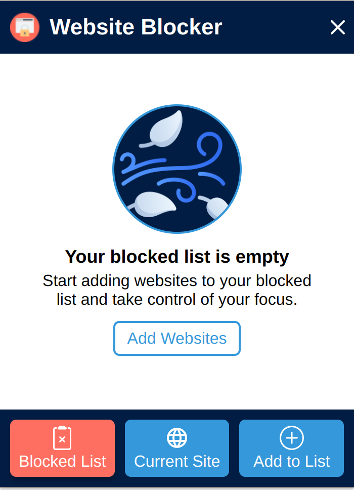
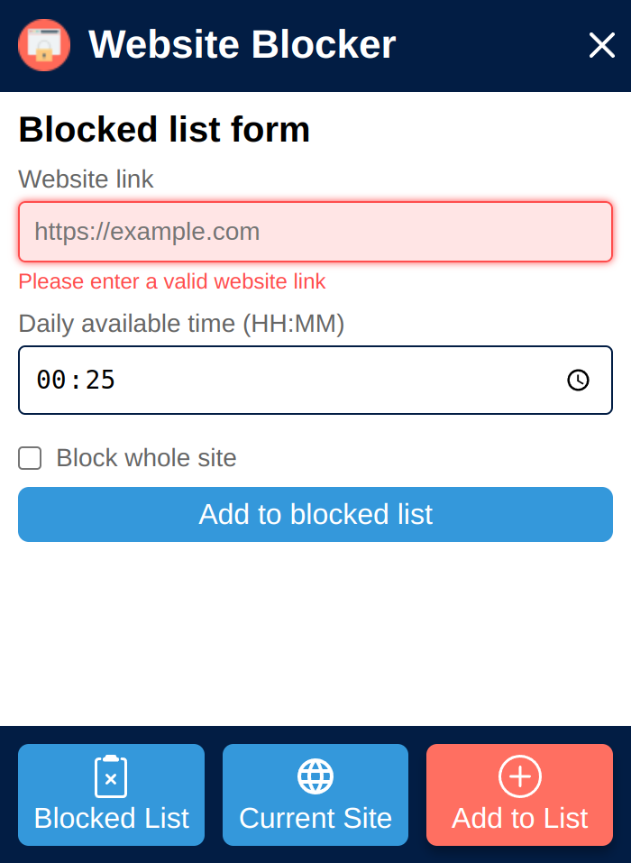
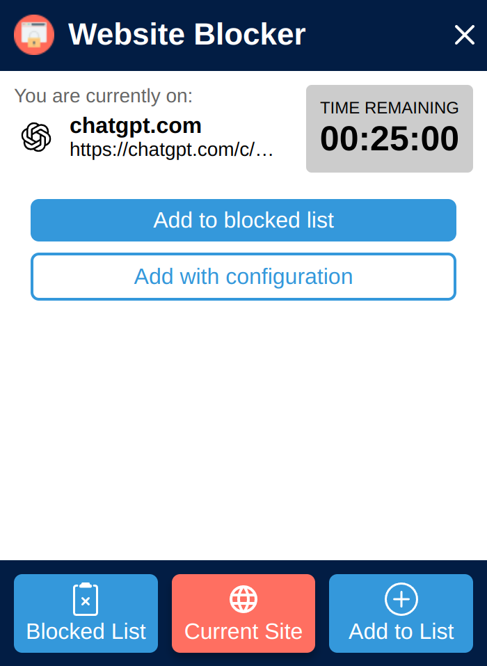
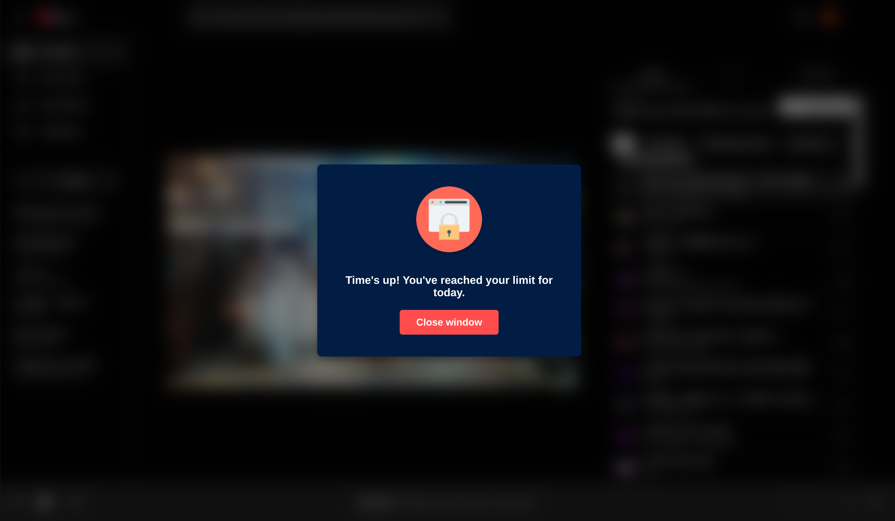
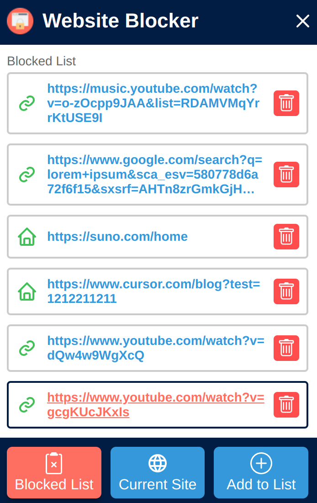

# Website Blocker Chrome Extension

Stay focused by blocking distracting websites with ease.

## 🚀 Features

- Blocks distracting websites to help you stay focused.
- Customizable block lists for personal preferences.
- Works offline and is easy to use.
- Option to schedule website blocking for certain times.

## 🛠 Stack

- JavaScript
- HTML
- CSS
- Vite

## 🖥️ How to Run Locally

### 1️⃣ Clone the repository

```bash
git clone https://github.com/AndreyProvozen/website-blocker.git
cd website-blocker
```

### 2️⃣ Install Dependencies

```bash
npm install
```

### 3️⃣ Load the extension in your browser

- **Development Mode (Unbuilt Version)**

1. Open chrome://extensions/ in Chrome.
1. Enable **Developer mode** (top right corner).
1. Click **Load unpacked** and select the **website-blocker** project folder.

- **Production Mode (Built Version)**

1. Run build command: `npm run build`
1. Open `chrome://extensions/` in Chrome.
1. Enable **Developer mode** (top right corner).
1. Click **Load unpacked and select** the **website-blocker/dist** folder

## 🎯 Future Plans

- Add pagination, search, and filtering options for the blocked sites list.
- Implement an edit option for blocked sites
- Refactor and optimize time logic

## 📸 Screenshots

### Empty Blocked Sites List



### Add to Blocked Sites tab



### Current Site tab



### Expiration Screen



### Blocked Sites List



## 🎨 Credits

- **Logo:** Icon by [Iconsmeet](https://www.freepik.com/icon/web-lock_18495899#fromView=search&page=6&position=22&uuid=759a42bf-e5b1-44cf-acc9-d8ecd9995534).

- **Empty List Icon:** Icon by [Ghozi Muhtarom](https://www.flaticon.com/free-icons/no-data).

## 📜 License

This project is licensed under the [MIT License](https://mit-license.org/).
